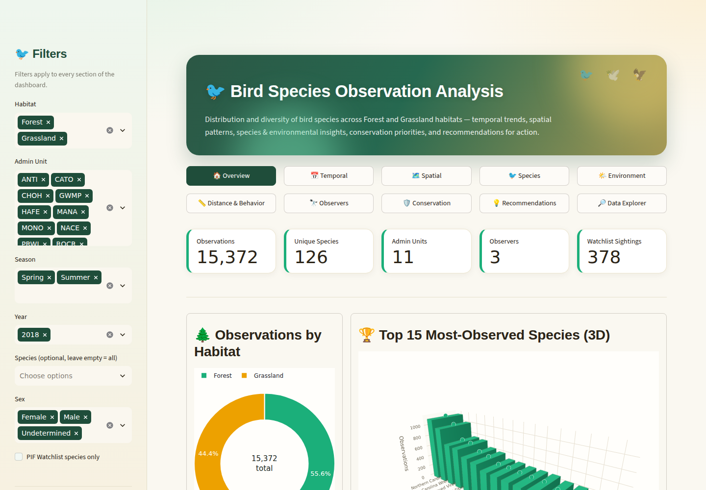
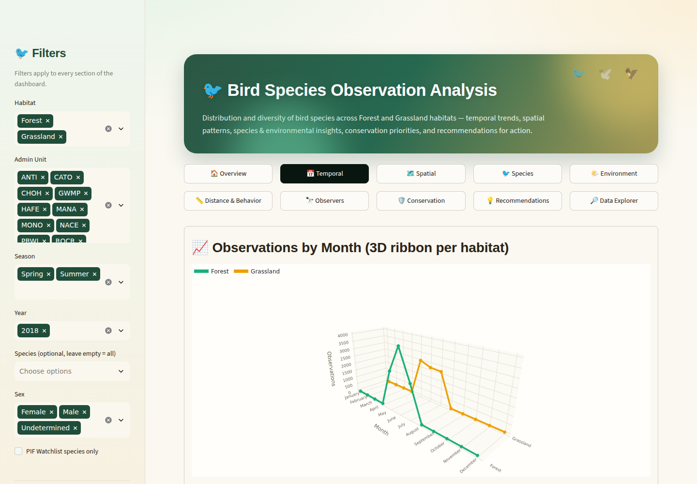
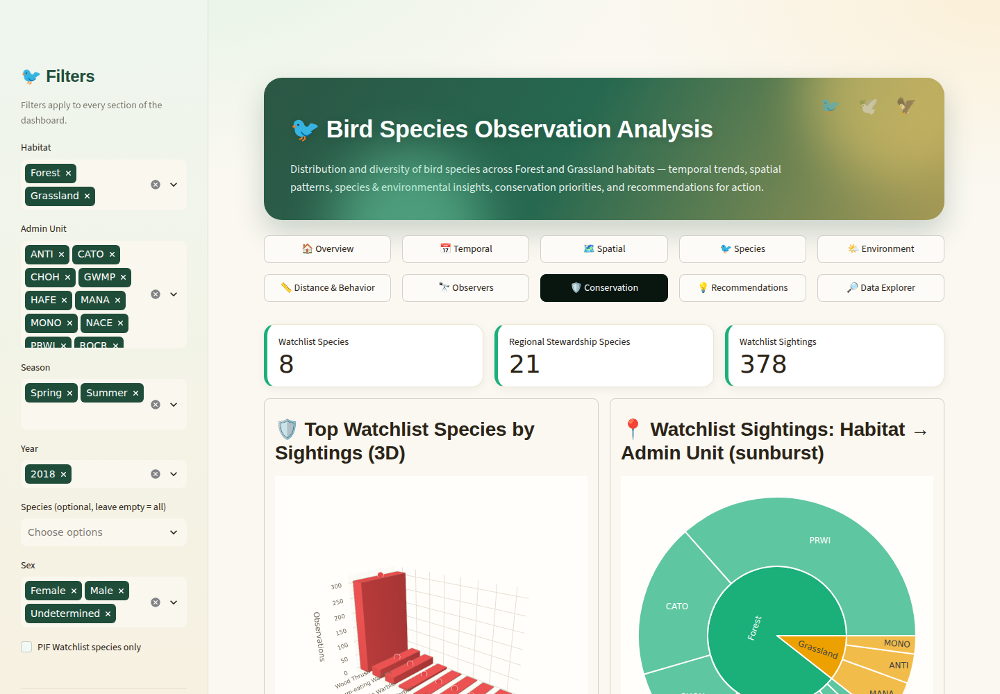
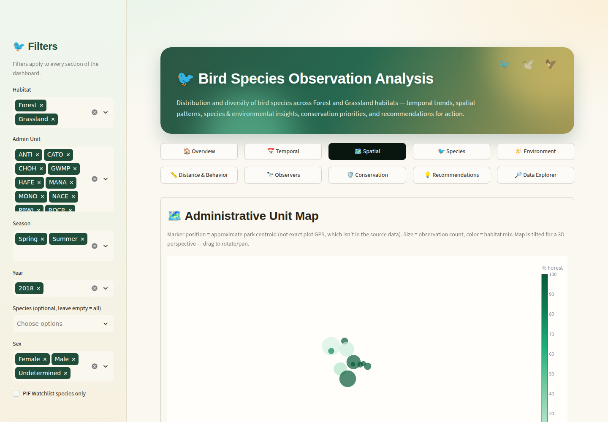
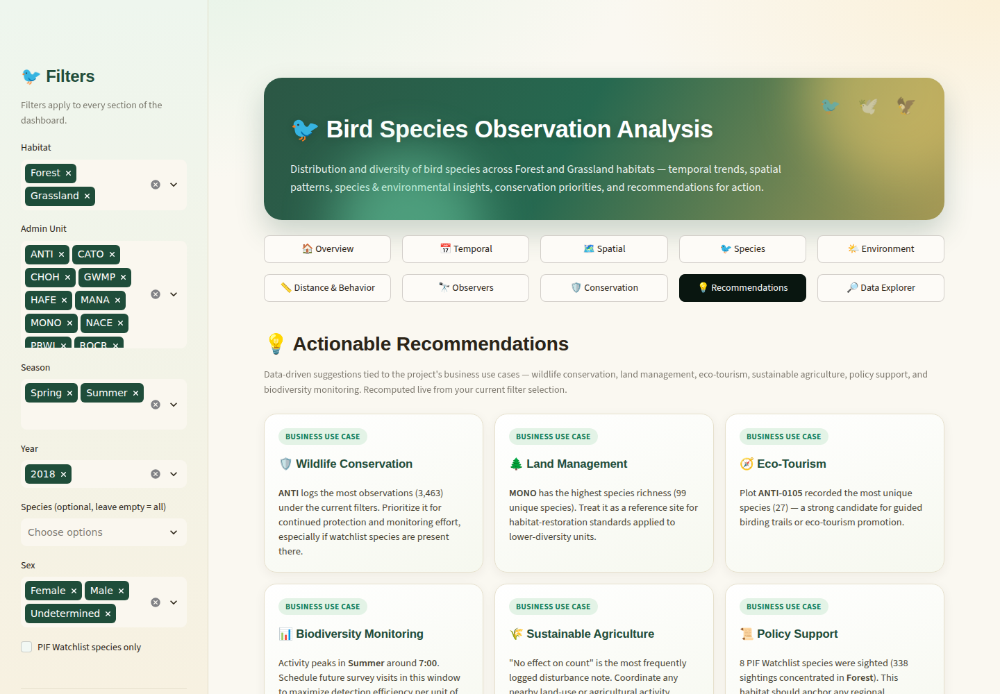

# 🐦 Bird Species Observation Analysis

**An interactive Streamlit dashboard analyzing bird biodiversity across Forest and Grassland habitats in 11 U.S. National Park Service administrative units.**




## 🔗 Live Demo

**[your-app-name.streamlit.app](https://your-app-name.streamlit.app)** — *(update this link once you deploy — see [Deployment](#-deployment-streamlit-community-cloud) below)*

## 📖 About This Project

I built this project to turn a raw National Park Service bird-monitoring dataset into something people could actually explore, not just a static report. The source data covers **15,372 point-count observations** of **126 bird species**, collected across **Forest and Grassland habitats** in 11 park units in the National Capital Region during the 2018 breeding season.

Bird populations are one of the strongest bioindicators of ecosystem health, so I approached this as more than an EDA exercise — the goal was to surface patterns that actually matter for conservation planning, land management, and eco-tourism, and package them into a dashboard that updates live as you filter the data.

## ✨ Features

- **10 interactive sections** — Overview, Temporal, Spatial, Species, Environment, Distance & Behavior, Observers, Conservation, Recommendations, and a raw Data Explorer
- **Global filters** — habitat, administrative unit, season, year, species, and sex, applied instantly across every chart on the page
- **Chart variety by design** — donuts, treemaps, a sunburst, radar and polar-bar charts, a funnel, a violin plot, lollipop charts, and line/area trends, alongside 3D bar, ribbon, surface, and scatter charts where a third dimension genuinely adds insight
- **Live-recomputing Recommendations** — actionable insight cards tied to real business use cases (wildlife conservation, land management, eco-tourism, biodiversity monitoring, sustainable agriculture, policy support), recalculated from whatever filters are currently active
- **SQLite-backed** — the app queries a proper database rather than re-parsing spreadsheets on every load
- **Nature-inspired theme** — a custom green-and-gold palette, glassmorphic header, and a real button-based navigation bar (chosen deliberately over Streamlit's native tabs — see [Notes & Assumptions](#-notes--assumptions))

## 🖼️ Screenshots

| Temporal trends | Conservation insights |
|---|---|
|  |  |

| Spatial map | Recommendations |
|---|---|
|  |  |

## 🔍 Key Insights

- **Forest habitat carries disproportionate conservation value.** 89% of all PIF Watchlist sightings (338 of 378) occurred in Forest habitat, driven overwhelmingly by the Wood Thrush (309 sightings on its own).
- **Dawn is prime time.** Over 70% of all observations happened between 6–8 AM, aligning with peak dawn-chorus vocal activity — most detections (63%) were identified by song alone.
- **Monocacy National Battlefield is the richness hotspot**, with 99 of the 126 total species recorded there — the highest of any of the 11 units.
- **Species richness is nearly identical across habitats** (108 species in Forest vs. 107 in Grassland) despite Forest contributing more raw observations, suggesting Grassland sites are just as diverse per unit of survey effort.
- **Survey conditions were reliable** — under 3% of surveys were logged with a serious disturbance effect on the count, so the patterns above reflect real bird activity rather than noisy field conditions.

## 🛠️ Tech Stack

| Layer | Tools |
|---|---|
| Data cleaning / ETL | Python, Pandas, openpyxl |
| Storage | SQLite |
| Visualization | Plotly (2D + 3D: Mesh3d, Scatter3d, Surface, Scattermap) |
| App framework | Streamlit |
| Deployment | Streamlit Community Cloud |

## 📁 Project Structure

```
bird_species_project/
├── assets/                                   # README screenshots
├── data/
│   ├── Bird_Monitoring_Data_FOREST.XLSX      # raw source (11 sheets, one per admin unit)
│   ├── Bird_Monitoring_Data_GRASSLAND.XLSX   # raw source (11 sheets, one per admin unit)
│   └── cleaned_bird_data.csv                 # generated by data_prep.py
├── .streamlit/
│   └── config.toml                           # theme config
├── bird_monitoring.db                        # generated SQLite database (used by the app)
├── data_prep.py                              # cleaning / preprocessing / ETL script
├── app.py                                    # Streamlit dashboard
├── requirements.txt
└── README.md
```

## 🧹 Data Cleaning & Preprocessing

The raw data arrived as two Excel workbooks (Forest and Grassland), each with 11 sheets — one per park unit — and the two didn't share an identical schema. `data_prep.py` handles the full pipeline:

1. **Loads all 22 sheets** and tags each row with its habitat and source sheet.
2. **Reconciles schema differences** — unifies `NPSTaxonCode` (Forest) and `TaxonCode` (Grassland) into one `Taxon_Code` column, and fills in the columns unique to each habitat as nulls on the other side so both share one schema.
3. **Cleans the data** — trims whitespace, drops ~1,700 exact duplicate rows, standardizes boolean columns, fills missing `Sex` with `"Undetermined"` and missing `Distance` with `"Not Recorded"`, and parses date/time fields.
4. **Engineers features** used throughout the dashboard — `Month_Name`, `Season`, `Day_Of_Week`, `Start_Hour`, and `Observation_Duration_Min`.
5. **Writes output** to `data/cleaned_bird_data.csv` and loads it into `bird_monitoring.db` (table `bird_observations`, plus a small `admin_unit_locations` lookup for the map).

**Result:** 15,372 cleaned observations, 126 species, across 2 habitats and 11 administrative units.

## 🚀 Getting Started

1. **Clone the repo and install dependencies:**
   ```bash
   git clone https://github.com/<your-username>/<your-repo>.git
   cd <your-repo>
   python -m venv venv && source venv/bin/activate   # Windows: venv\Scripts\activate
   pip install -r requirements.txt
   ```
2. **(Optional) Regenerate the cleaned dataset** — only needed if you replace the source Excel files; `bird_monitoring.db` is already included:
   ```bash
   python data_prep.py
   ```
3. **Run the app:**
   ```bash
   streamlit run app.py
   ```
4. Open **http://localhost:8501** in your browser.

## ☁️ Deployment (Streamlit Community Cloud)

1. Push this repo to GitHub (`bird_monitoring.db` and `data/cleaned_bird_data.csv` should be committed — the app reads them directly, and the whole project is well within GitHub's size limits).
2. Go to **[share.streamlit.io](https://share.streamlit.io)**, sign in with GitHub, and click **Create app → Deploy a public app from GitHub**.
3. Set **Repository** to `<your-username>/<your-repo>`, **Branch** to `main`, and **Main file path** to `app.py`.
4. Click **Deploy**. Your app will be live at `https://<your-app-name>.streamlit.app` within a couple of minutes, and future `git push`es to `main` redeploy it automatically.

## 📝 Notes & Assumptions

- All observations fall within **2018** — a Year filter is still included so the app keeps working unchanged if the dataset is extended with more years later.
- The map on the **Spatial** page plots each administrative unit at its approximate park centroid, not exact survey-plot GPS, since the source data doesn't include plot-level coordinates.
- Navigation uses real buttons rather than `st.tabs`, on purpose: browsers cap the number of simultaneous WebGL contexts a page can hold (commonly ~16), and several sections here use 3D Plotly charts. `st.tabs` renders every tab into the page at once, which would exceed that cap and silently blank out charts. The button nav only builds the active section's charts, so this never happens.
- "Watchlist" refers to Partners in Flight (PIF) Watchlist status; "Stewardship" refers to Regional Stewardship Status.
- The **Recommendations** page recomputes its insights live from whatever filters are applied, so it stays accurate at any level of drill-down.

## 🙏 Acknowledgments

Data sourced from the U.S. National Park Service's Forest and Grassland bird-monitoring point-count program.

## 📬 Connect

If you found this project interesting, feel free to connect with me or check out my other work.

<!-- Add your LinkedIn / portfolio / other links here -->
